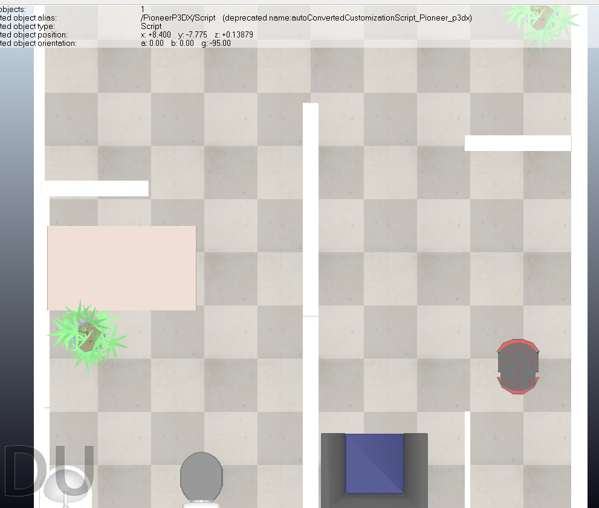

# Robótica Móvel 

> Universidade Federal da Bahia
> 
> Docente: Andre Gustavo Scolari Conceicao 
> 
> Semestre: 2024.2

## Sobre o Trabalho

### Introdução

- Projeto para implementação de um Robô Pioneer 3DX com de um sistema de localização baseado em Odometria e estratégia de navegação utilizando a metologia de Braitenberg.

Estre projeto inclui:

- Controlador Proporcional de Velocidade
- Controle da Posição com base no Ground Truth
- Algoritmo de Brainterberg para desvio de objetos
- Construção de cenário e simulação usando CopeeliaSim

### Resultado

### Ambiente de Treinamento

## Equipe 6 - Colaboradores

<table>
  <tr>
    <td align="center">
      <a href="http://ivesvh.com">
        
         
        <b>Elder Pereira 💻</b>
      </a>
    </td>
    <td align="center">
      <a href="http://ivesvh.com">
        
         
        <b>Salomão</b>
      </a>
    </td>
  </tr>
</table>

